# 🏥 Healthcare Provider & Insurance Analytics

A complete end-to-end Healthcare Analytics project built using **PostgreSQL 18**. This project simulates a real-world healthcare management system with over **617,000 records**, demonstrating database design, SQL analytics, PostgreSQL programming, and performance optimization.

---

# 📌 Project Overview

This project was developed to demonstrate practical SQL skills required for Data Analyst and Business Intelligence roles.

The database models a healthcare ecosystem consisting of:

- Hospitals
- Departments
- Doctors
- Patients
- Appointments
- Diagnoses
- Treatments
- Prescriptions
- Insurance Providers
- Insurance Policies
- Claims
- Payments

The project includes advanced SQL concepts such as Views, Functions, Stored Procedures, Triggers, and Indexes.

---

# 🚀 Technologies Used

| Technology | Version |
|------------|---------|
| PostgreSQL | 18 |
| pgAdmin | 4 |
| SQL | PostgreSQL SQL |
| Python | Pandas, Faker |
| Git | Version Control |
| GitHub | Project Repository |

---

## Dataset Generation

The healthcare dataset was programmatically generated using Python.

**Tools Used:**

- Pandas
- Faker
- Random

The generation scripts are available in the `scripts/` folder.


# 📊 Dataset Summary

| Table | Records |
|--------|--------:|
| Hospitals | 20 |
| Departments | 197 |
| Doctors | 696 |
| Patients | 10,000 |
| Appointments | 100,000 |
| Diagnoses | 75,090 |
| Treatments | 75,090 |
| Prescriptions | 187,840 |
| Insurance Providers | 15 |
| Insurance Policies | 8,000 |
| Claims | 60,309 |
| Payments | 100,000 |

## Total Records

**617,257**

---

# 🗂 Project Structure

```text
Healthcare_SQL_Project/

│
├── data/
│
├── docs/
│   └── healthcare_erd.png
│
├── screenshots/
│
├── SQL/
│   ├── 01_create_database.sql
│   ├── 02_create_schema.sql
│   ├── 03_create_tables.sql
│   ├── 04_import_csv.sql
│   ├── 05_data_validation.sql
│   ├── 06_basic_queries.sql
│   ├── 07_intermediate_queries.sql
│   ├── 08_advanced_queries.sql
│   ├── 09_views.sql
│   ├── 10_functions.sql
│   ├── 11_stored_procedures.sql
│   ├── 12_triggers.sql
│   └── 13_indexes.sql
│
├── README.md
└── LICENSE
```

---

# 🏗 Database Schema

The project consists of **12 relational tables** connected using primary and foreign keys.

### Entity Relationship Diagram


---

# 📷 Project Screenshots

## Database

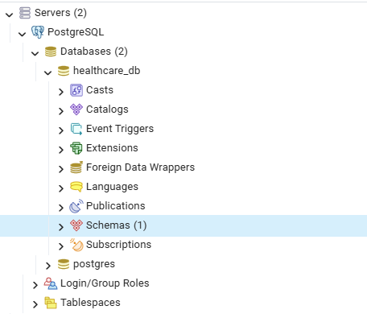
---

## Tables

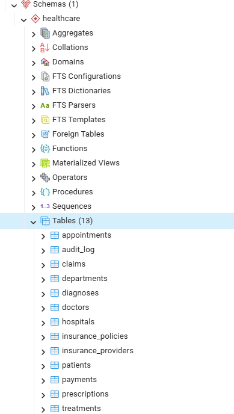
---

## Entity Relationship Diagram

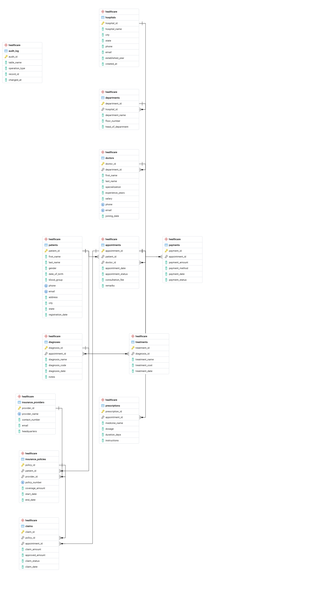
---

## SQL Query Examples

### Basic Query

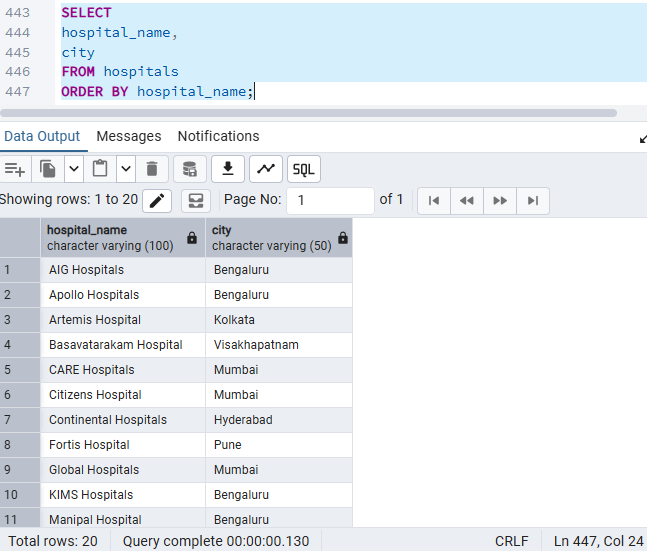

### Intermediate Query

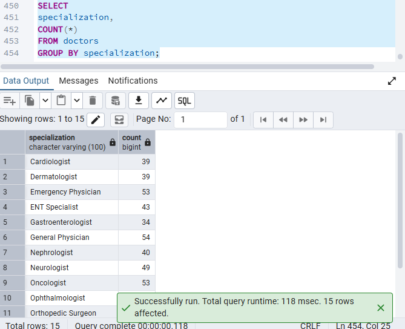

### Advanced Query

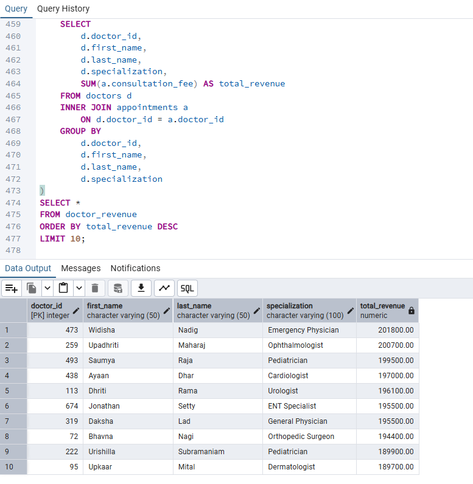

---

## PostgreSQL Objects

### Views

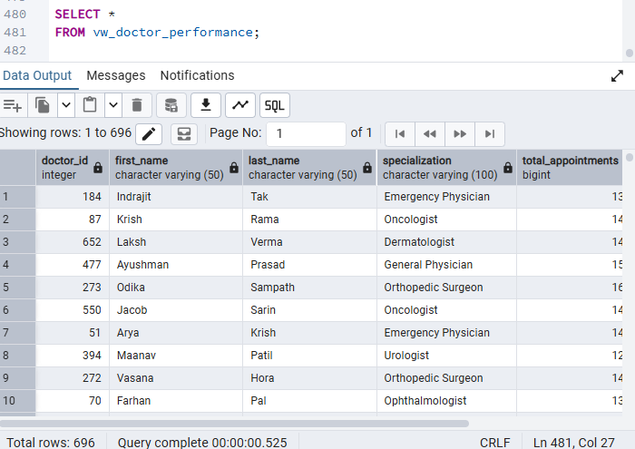

### Functions

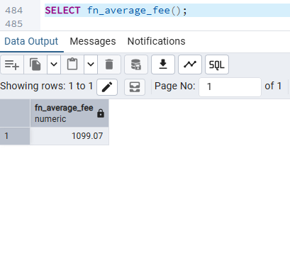

### Stored Procedures

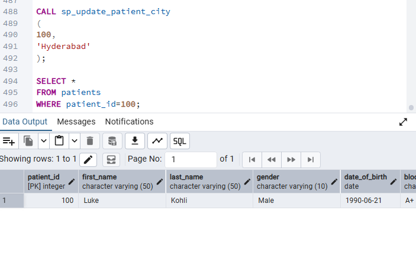

### Triggers

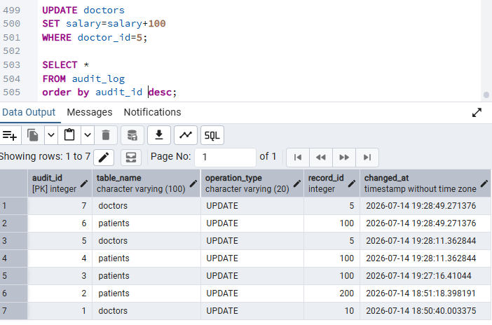


### Indexes

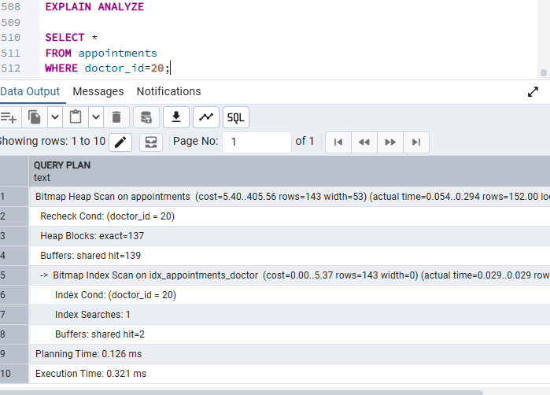
---

# ✨ SQL Features Demonstrated

- Database Design
- Data Modeling
- Primary Keys
- Foreign Keys
- Constraints
- Views
- Functions
- Stored Procedures
- Triggers
- Indexes
- Aggregate Functions
- Window Functions
- CASE Statements
- CTEs
- Subqueries
- JOIN Operations
- Performance Optimization

---

# 📈 Business Problems Solved

- Hospital Performance Analysis
- Doctor Revenue Analysis
- Patient Appointment Analysis
- Insurance Claim Tracking
- Payment Analysis
- Treatment Analytics
- Department Performance
- Consultation Revenue Reporting

---

# 📊 Project Statistics

| Category | Count |
|----------|------:|
| Tables | 12 |
| SQL Queries | 125 |
| Views | 10 |
| Functions | 10 |
| Stored Procedures | 10 |
| Triggers | 8 |
| Indexes | 10 |
| Records | 617,257 |

---

# ▶️ How to Run the Project

1. Create the PostgreSQL database.
2. Execute the SQL scripts in numerical order.
3. Import the CSV files using pgAdmin.
4. Run the validation script.
5. Explore the analytical SQL queries.

---

# 🔮 Future Enhancements

- Power BI Dashboard
- Python Exploratory Data Analysis (EDA)
- Excel Dashboard
- Machine Learning Models
- Interactive Business Reports

---

# 👨‍💻 Author

**Satish Mudari**

Data Analyst | SQL | PostgreSQL | Python | Power BI | Excel

LinkedIn: https://www.linkedin.com/in/satishmudari/

GitHub: https://github.com/satish624